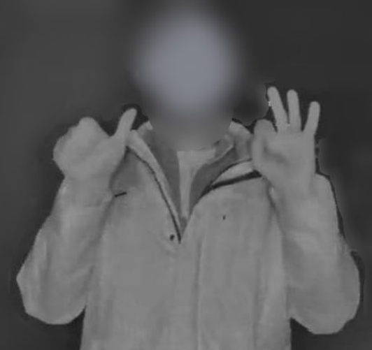
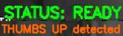

[](https://www.python.org/)
[](https://github.com/ultralytics/ultralytics)
[](https://opencv.org/)
[](https://developer.nvidia.com/cuda-toolkit)


# 🚪 Gesture Domofon — система автоматического открытия домофона по распознаванию жестов

# ⚠️❗️Проект предназначен исключительно для **образовательных и исследовательских целей**❗️⚠️

## 📖 Оглавление

- [О проекте](#-о-проекте)
- [Создание собственного датасета](#-создание-собственного-датасета)
- [Обучение YOLOv8m](#-обучение-yolov8m)
- [Результаты обучения](#-результаты-обучения)
- [Логика работы программы](#-логика-работы-программы)
- [Демонстрационный интерфейс](#-демонстрационный-интерфейс)
- [Безопасность](#-безопасность)
- [Установка](#-установка)
- [Конфигурация](#%EF%B8%8F-конфигурация)

---

## 🧠 О проекте

Вдохновением послужила **[данная статья на Habr](https://habr.com/en/articles/561502/)**, прочитанная мной около двух лет назад.

Автор использовал распознавание лиц для идентификации жильцов и автоматического открытия двери. Однако я решил пойти другим путём:

- **Распознавание лиц** показалось слишком сложным для реализации в условиях уличной камеры домофона:
  - низкое разрешение и плохое качество изображения;
  - сильная зависимость от освещения;
  - необходимость собирать и хранить базу лиц жильцов (вопрос приватности).

Распознавание жестов оказалось более практичным решением для экспериментального проекта.

В процессе изучения работы приложения домофона опытным путём была обнаружена возможность открытия домофонной двери путем отправки POST-запроса. Также в открытом виде была обнаружена ссылка на RTSP-поток.

Так и появилась идея использовать этот механизм как основу для пет-проекта по компьютерному зрению: добавить собственный CV-слой, который будет определять намерение пользователя открыть домофонную дверь по жесту (жестам).

Главная проблема заключалась в качестве исходного видеопотока. Уличная камера домофона имеет ограниченное разрешение и артефакты сжатия, из-за чего [популярный датасет для обучения моделей распознавания жестового языка](https://www.kaggle.com/datasets/gti-upm/leapgestrecog) работал недостаточно стабильно в текущих условиях.



Вместо использования готового датасета я решил собрать его самостоятельно под условия эксплуатации системы.

---

## 📷 Создание собственного датасета

Для обучения использовались данные, собранные непосредственно с камеры домофона.

Это было необходимо из-за специфики исходного изображения:

- низкое качество камеры;
- различные условия освещения (день/ночь);
- небольшой размер руки в кадре.

Поэтому я записал собственные видео непосредственно перед камерой домофона, выполняя необходимые жесты на рабочей дистанции.

### Извлечение кадров

Исходное видео нарезалось на отдельные изображения с помощью FFmpeg:

```bash
ffmpeg -i video1.avi -vf "fps=2" -q:v 1 frames/frame_%06d.jpg
```

После этого из полученных кадров отбирались изображения с необходимыми жестами и выполнялась ручная разметка bounding boxes в [Label-studio](https://github.com/HumanSignal/label-studio).

Можно было использовать pseudo labeling, но планируемый размер датасета позволял не заморачиваться. ~~А вообще-то было просто лень...~~


Размечались два класса:

```text
thumbs_up - жест 👍 (класс/палец вверх)
ok - жест 👌 (ок/окей)
```

---

## 🧠 Обучение YOLOv8m

В качестве базовой модели использовалась предварительно обученная [**YOLOv8m**](https://docs.ultralytics.com/ru/models/yolov8), которую я самостоятельно дообучил на собранном датасете.

### Конфигурация обучения

| Параметр | Значение |
|---|---:|
| Base model | YOLOv8m |
| Epochs | 50 |
| Image size | 640×640 |
| Batch size | 8 |
| Device | CUDA GPU |
| Classes | 2 |
| Classes | `thumbs_up`, `ok` |


```python
from ultralytics import YOLO

model = YOLO("yolov8m.pt")

model.train(
    data="data.yaml",
    epochs=50,
    imgsz=640,
    batch=8,
    device=0,
    workers=0,

    # Augmentation
    hsv_h=0.02,
    hsv_s=0.8,
    hsv_v=0.5,

    degrees=15,
    translate=0.1,
    scale=0.5,
    shear=2.0,

    fliplr=0.5,
    flipud=0.0,

    mosaic=1.0,
    mixup=0.1,

    close_mosaic=10
)
```

### Использованные аугментации

Для повышения устойчивости модели применялись:

- изменение оттенка, насыщенности и яркости;
- случайный поворот до ±15°;
- сдвиг изображения;
- масштабирование;
- shear transformation;
- горизонтальное отражение;
- Mosaic augmentation;
- MixUp.

---

## 📊 Результаты обучения


На последней, 50-й эпохе:

| Metric | Value |
|---|---:|
| Precision | **81.55%** |
| Recall | **62.26%** |
| mAP@50 | **71.96%** |
| mAP@50-95 | **44.00%** |

Лучшее значение `mAP@50-95` в процессе обучения было получено на **40-й эпохе**:

| Metric | Epoch 40 |
|---|---:|
| Precision | **84.64%** |
| Recall | **64.89%** |
| mAP@50 | **73.11%** |
| mAP@50-95 | **46.25%** |

### Интерпретация

- **Precision 84.6%** — большинство обнаруженных объектов действительно являются целевыми жестами.
- **Recall 64.9%** — модель пропускает часть жестов, что ожидаемо для изображения с камеры домофона низкого качества.
- **mAP@50 73.1%** — модель достаточно хорошо обнаруживает целевые объекты при IoU=0.5.
- **mAP@50-95 46.3%** — более строгая оценка качества локализации bounding boxes.

Для данного проекта важнее всего не идеальная локализация bounding box, а надёжное определение наличия двух жестов на изображении.


---

## ⚡ Логика работы программы

Захват кадров и распознавание выполняются в отдельных потоках:

### Capture Thread

Отдельный поток непрерывно получает кадры из RTSP-потока.

### Frame Queue

Используется очередь размером `1`.

Если новый кадр поступает быстрее, чем модель успевает его обработать, старый кадр отбрасывается. Это позволяет избежать накопления задержки. Для интерактивной системы такой подход предпочтительнее обработки каждого кадра подряд: модели важнее получить самый свежий кадр, чем гарантированно обработать все кадры потока.

### Detection Thread

Используется GPU при наличии CUDA.

### 🎯 Логика распознавания

Модель распознаёт два класса:

```text
👍 thumbs_up
👌 ok
```

Для каждой детекции проверяется значение `confidence`. Порог вынесен в конфигурацию:

```python
CONFIDENCE_THRESHOLD = 0.8
```

Система сохраняет информацию о наличии каждого из двух жестов на текущем кадре. 

Открытие выполняется только при **одновременном обнаружении обоих жестов**. 

Если обнаружен только один жест, система продолжает ожидать второй.

Для предотвращения повторных команд установлен cooldown:

```python
COOLDOWN_SECONDS = 5
```

После успешного открытия следующая команда не может быть отправлена до истечения указанного интервала.

### 🔐 Интеграция с домофоном

В открытой части проекта взаимодействие с системой управления представлено функцией:

```python
def open_door(self):
    # Открытие домофона
    ...
```

Конкретная реализация функции намеренно не публикуется, поскольку содержит чувствительные детали взаимодействия с API домофона.

--- 

## 🖥 Демонстрационный интерфейс

На этапе разработки проект тестировался на Windows с использованием OpenCV.

Окно демонстрации отображает текущий кадр с камеры и статус работы модели:

```text
Waiting for gestures...

THUMBS UP detected - need OK

OK detected - need THUMBS UP

BOTH GESTURES DETECTED!

STATUS: READY
GPU: True
```



При обнаружении обоих жестов программа вызывает API открытия двери.

---

## 🔐 Безопасность

Проект взаимодействует с реальной системой контроля доступа и поэтому намеренно не содержит в открытом виде реальные детали доступа к конкретному устройству.

В процессе разработки RTSP-видеопоток и механизм взаимодействия с API домофона были исследованы экспериментальным путём, включая анализ поведения клиентского приложения и реверс-инжиниринг сетевого взаимодействия.

По соображениям безопасности **конкретные рабочие ссылки на видеопоток, токены и чувствительные детали запросов для управления замком не публикуются**.


### Ограничения безопасности самого подхода

Распознавание жестов является экспериментальным способом идентификации намерения пользователя. Сам по себе жест не является надёжным фактором аутентификации: его может повторить другой человек, а ошибки компьютерного зрения могут привести как к ложному срабатыванию, так и к пропуску жеста.

⚠️❗️Проект предназначен исключительно для **образовательных и исследовательских целей**❗️⚠️

---

## 🚀 Установка

### Требования

- Python 3.8+
- PyTorch
- Ultralytics
- OpenCV
- FFmpeg - использовался для "нарезки" видео на кадры
- CUDA GPU — рекомендуется для более быстрой работы


### Установка зависимостей

```bash
pip install -r requirements.txt
```

> Для ускорения рекомендуется устанавливать [PyTorch](https://pytorch.org/get-started/locally/) с соответствующей версией [CUDA](https://developer.nvidia.com/cuda/toolkit).

---

## ⚙️ Конфигурация

Все параметры проекта вынесены в отдельный `config.py`.

### Основные параметры

| Параметр | Описание | Значение по умолчанию |
|---|---|---:|
| `TARGET_FPS` | Частота запуска inference | `4` |
| `CONFIDENCE_THRESHOLD` | Минимальный confidence для детекции | `0.8` |
| `COOLDOWN_SECONDS` | Минимальный интервал между открытиями двери | `5` сек |
| `MODEL_PATH` | Путь к обученной YOLO-модели | `model.pt` |
| `IMAGE_SIZE` | Размер изображения для inference | `640` |
| `DISPLAY_WIDTH` | Ширина окна демонстрации | `1280` |
| `DISPLAY_HEIGHT` | Высота окна демонстрации | `720` |


---


